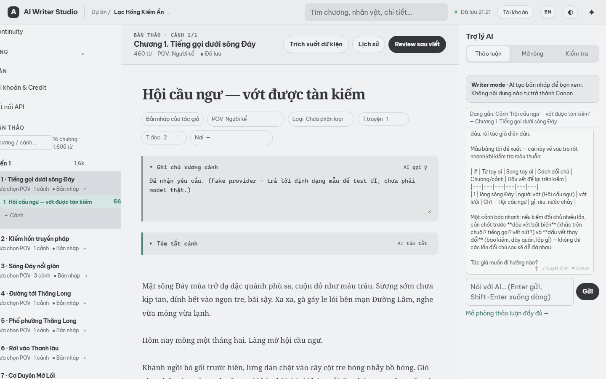
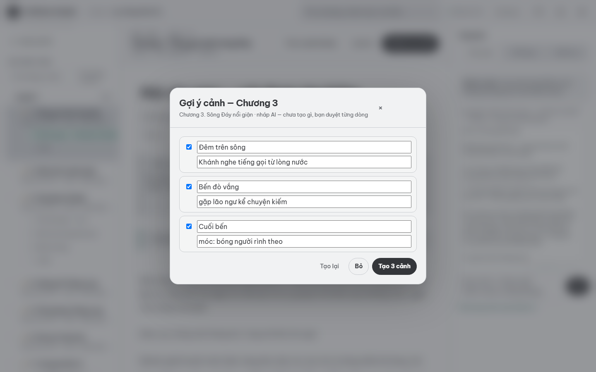
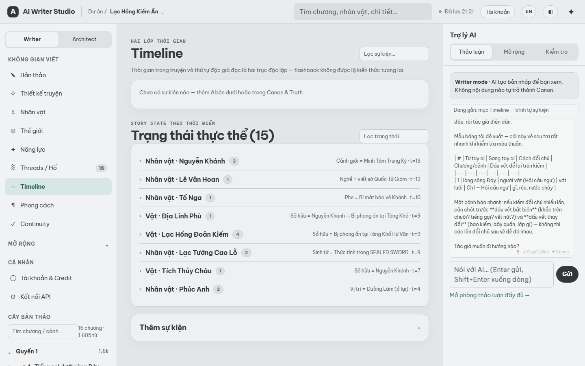

# AI Writer Studio

**A Story OS for long-form fiction with two workflows — write first and let AI expand, or let AI draft entire arcs while you audit and repair.**

> Ứng dụng viết tiểu thuyết dài kỳ hai chiều: tác giả viết trước, AI hỗ trợ thảo luận/mở rộng — hoặc AI viết nháp cả trăm chương, tác giả rà soát, sửa đoạn, giữ quyền quyết định cuối. Mọi gợi ý của AI là bản nháp — không có gì tự động trở thành Canon.

   



## Why another AI writing tool?

Most AI writing apps make the model the author. This one makes the model a *fast, auditable* co-writer under an editor-in-chief:

- **The author is the source of truth.** AI output is always a draft — it only becomes canon through an explicit review/approval step.
- **Two directions, one tool.** Write yourself and ask AI to discuss/expand a passage — or run a whole wave of chapters through the pipeline, then repair: deterministic continuity scan → AI deep-check per chapter → keep-the-value conflict fixes → selection-scoped rewrite of just the paragraph that's wrong.
- **Continuity is data, not vibes.** Characters, locations, abilities, relationships, canon facts, story states, knowledge states (who knows what, since when) and narrative threads are tracked in a story database that AI is *constrained* by — not trusted to remember.
- **Long-form scale.** Hundreds of chapters stay manageable via a volume → arc → chapter → scene hierarchy, layered summaries, repair operations that shift the whole narrative axis atomically, and context manifests that show exactly what the model received.
- **Honest about limits.** Provider capability tiers adapt prompt sizes to what your API actually tolerates; slow gateways get small windows and graceful retries instead of silent truncation.

## Features

- **Manuscript editor** — scene-first writing with skeleton notes, briefs, autosave, POV/temporal metadata, per-scene version history with restore
- **Story database** — characters (aliases, arcs), locations, items, factions, abilities, relationships
- **Canon & truth layer** — canon facts with truth status (`CANON`/`RUMOR`/`PLANNED`), secrets, author decisions
- **Continuity engine** — 10+ deterministic checkers: canon/state conflicts, state regression, location drift, phase leak, missing extraction, restricted appearance, knowledge-leak, stale-thread; post-generation issue flags
- **AI deep-check** — per-chapter AI audit writes `audit_findings`; window size adapts to the credential's capability tier so a big-context API reads the whole chapter in one call
- **Repair workflow** — insert a chapter mid-story (narrative axis shifts atomically), re-extract facts after prose edits, delete+compact a chapter, "keep this value" conflict resolution, AI fix with preview → apply
- **Selection-scoped revision** — highlight a passage, AI rewrites only that fragment with surrounding context, preview then splice back — long scenes never hit gateway timeouts
- **Timeline** — story-time vs narrative-order events, story states per entity, human-readable state rendering (VI/EN), three view modes
- **AI assistant (BYOK)** — provider/model routing per task, usage logging, encrypted credentials, capability tier per key (low/standard/strong, auto-detected, overridable)
- **AI memory** — every AI call is persisted (`ai_turns`), recent scene turns are re-injected, layered `story_summaries` with coverage dashboard, relevance-ranked character/canon context with a transparent manifest
- **Author-approved AI workflows** — scene skeleton suggestions, chapter outline generation (edit/approve before scenes are created), expansion & revision drafts, scene summarization, character profile assist
- **What-if branches** — explore alternate storylines, preview impact, merge only through author decisions
- **Review queue** — AI-proposed canon/relationship changes wait for author approval
- **Whole-project tools** — full-text search with deep links, JSON export / Markdown manuscript export, per-chapter reading mode
- **Vietnamese-first UI** with English translation




## Architecture

```
frontend/   Next.js 15 + React 19 + TypeScript — 3-pane writer workspace
backend/    FastAPI + SQLAlchemy 2 (async) + Alembic
            SQLite by default (writer.db) · Postgres/pgvector via docker-compose
            Provider adapters: OpenAI-compatible endpoints (OpenAI, OpenRouter,
            DeepSeek, Gemini, KiraAI, custom base URL) + Anthropic native
            + deterministic FakeProvider for dev
```

Key backend pieces:

| Path | Role |
|---|---|
| `app/ai/compose.py` | Prompt assembly — context manifest, session turns, ranked entities |
| `app/ai/router.py` | Model routing: project pref → account pref → fallback; provider capability tier |
| `app/services/continuity.py` | Deterministic continuity checkers |
| `app/services/memory.py` | Summaries, ancestor chain, AI turn history |
| `app/services/branch.py` | What-if branch diff/merge |
| `app/services/repair.py` | Chapter insert / re-extract / delete+compact along the narrative axis |

## Quickstart

Requirements: Python 3.12+, Node 20+

```bash
# backend
cd backend
python -m venv .venv && .venv/Scripts/activate   # Windows; source .venv/bin/activate on Unix
pip install -r requirements.txt
uvicorn app.main:app --port 8000

# frontend (new terminal)
cd frontend
cp ../.env.example ../.env   # or set NEXT_PUBLIC_API_URL=http://localhost:8000
npm install
echo NEXT_PUBLIC_API_URL=http://localhost:8000 > .env.local
npm run dev
```

Open http://localhost:3000 → create a project, or seed the demo:

```bash
cd backend
python seed_demo.py   # ~15-chapter demo project via REST API
```

`docker-compose.yml` is included for a Postgres + Redis setup; plain SQLite works out of the box for a single local author.

## AI providers

AI features are BYOK — add a provider key in **Cài đặt → Kết nối API**. Keys are Fernet-encrypted at rest; the API only ever returns a masked hint (`••••xxxx`). Without a key, tasks fall back to a deterministic `FakeProvider` so the whole UI stays testable.

Each credential carries a **capability tier** (`Yếu`/`Thường`/`Mạnh`) — auto-inferred from the provider, overridable per key. The tier tells the app how aggressively to split large prompts (e.g. a ~60s-capped gateway gets small deep-check windows; a strong API reads a whole chapter at once). It describes request capacity, not prose quality.

## Testing

```bash
cd backend && pytest          # 155 tests — API contracts, memory, continuity, repair
cd frontend && npx tsc --noEmit
```

## Status

Alpha, single-user local (`DEV_USER` — no real auth yet). Active work: layered auto-summarization, provider-held conversation threads, retrieval, packaging (Tauri). See `docs/ROADMAP.md` and `docs/STATUS.md` for the honest state of things.

## License

MIT — see [LICENSE](LICENSE).
